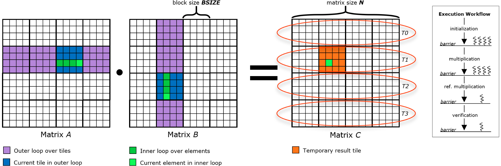
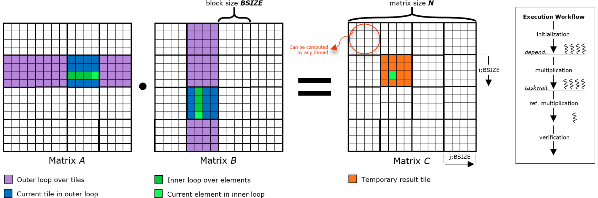

<div align="justify">

# EPEEC OmpSs-2 & OmpSs-2@Cluster Tutorial

This is a small tutorial on how to convert OpenMP applications to run on the OmpSs-2 programming model. We also provide guidelines on how to enable programming in a much larger scale than a single SMP, by using the cluster version of the model, utilizing both the MPI and ArgoDSM communication backends.

## The Simple Example

The example concerns a naive blocked matrix multiplication implementation, which is a kernel operation that calculates the product of two matrices. It is meant as an introduction to OmpSs-2 and OmpSs-2@Cluster and its differences with non-task-based and non-distributed applications. It is written in C++.

### OpenMP implementation

The full source code of the implementation can be found [here](https://github.com/IoanAnev/ompss-tutorial/blob/master/code/matmul-omp.cpp).

#### Allocation & Deallocation

The example starts with the working arrays being allocated using the C++ `new` operator.

```cpp
/* Allocate the matrices using C++ `new`  */
mat_a = new double[N][N]; // input  matrix
mat_b = new double[N][N]; // input  matrix
mat_c = new double[N][N]; // output matrix (optimized)
mat_r = new double[N][N]; // output matrix (reference)
```

At the end of program execution, the structures are deallocated using the `delete` operator.
```cpp
/* Deallocate the matrices using `delete` */
delete[] mat_a;           // -//-
delete[] mat_b;           // -//-
delete[] mat_c;           // -//-
delete[] mat_r;           // -//-
```

#### Initialization

After allocation, the arrays are being initialized collectively using the OpenMP worksharing-loop construct `pragma omp for`, for a correct and balanced NUMA node data distribution. Operation on the arrays is being done in a blocked manner for cache-friendly accesses.

```cpp
void
init_matrices()
{
  /**
   * @note: The initialization of the global matrices can
   *        also be handled by the master or by any thread
   */

  /* Parallelize for better NUMA node data distribution */
  #pragma omp for
    for (int i = 0; i < N; i += BSIZE)
      for (int j = 0; j < N; j += BSIZE)
        /* Init. a block for cache-friendly accesses    */
        init_block(i, j, BSIZE, mat_a, mat_b, mat_c, mat_r);
  /* _implicit barrier_ */
}
```

#### Computation

The multiplication is being done similar to the initialization, exploiting coarse-grained parallelism by parallelizing the outermost loop of the kernel, and using the method of tiling. Note that there is a barrier implied after each `pragma omp for` construct, thus there is no need for one to be exclusively included.

```cpp
void
matmul_opt()
{
  /* Parallel block-based computation */
  #pragma omp for
  for (int i = 0; i < N; i += BSIZE)
    for (int j = 0; j < N; j += BSIZE)
      for (int k = 0; k < N; k += BSIZE)
        /* Compute an individual block */
        multiply_block(i, j, k, BSIZE, mat_a, mat_b, mat_c);
  /* _implicit barrier_ */
}
```

#### Verification

The validity of the results is being checked by serially executing the kernel (no tiling), and then comparing the values of the output matrices from the two different kernels. Both the serial execution and the correctness test are handled by a single thread chosen at runtime through `pragma omp single`. Similar to `pragma omp for`, this construct also includes an implicit barrier at the end of its body.

```cpp
/**
 * @note: The serial execution can be handled by the master or
 *        by any thread as in this case
 */

/* Serial execution of matrix multiplication for verification      */
#pragma omp single
  matmul_ref();
/* _implicit barrier_ */

/**
 * @note: The verification can be handled by the master or
 *        by any thread as in this case
 */

/* Verify the results by finding the error between mat_c and mat_r */
#pragma omp single
  verify_results();
/* _implicit barrier_ */
```



<div align="center">

*OpenMP workload distribution and execution workflow*

</div>

### OmpSs-2 implementation

The full source code of the implementation can be found [here](https://github.com/IoanAnev/ompss-tutorial/blob/master/code/matmul-ompss-2.cpp).

#### Allocation & Deallocation

Since operation is still being done on the shared memory level, there is no difference in the allocation and deallocation mechanisms between the OpenMP and OmpSs-2 implementations.

#### Initialization

OmpSs-2 being a task-based runtime system, the way we distribute work differs from the OpenMP method of parallelization used in the current example. In this example, we choose to associate a task to each tile to be computed. That said, the main thread iterates over the loops and keeps spawning tasks, which then reside in the task pool, ready to be served by a team of threads. Which thread computes which tile is chosen by the runtime.

The tasks need to also include directionality annotations based on the type of accesses being done to the data structures operated in the task body. As the matrices are only written during initialization, we enclose them in the `out` clause. Aside from expressing data direction, we need to specify which section of data is going to be operated by each task, in order to build proper dependencies between tasks, and thus effectively avoid data races.

In OmpSs-2, directives can be _inlined_ or _outlined_. When inlined, the `pragma` applies immediately to the following statement, and the compiler outlines that statement as in OpenMP. The code block below presents an example of inlined directives.

```cpp
void
init_matrices()
{
  /**
   * @note: The initialization of the global matrices can
   *        also be handled by the master or by any thread
   */

  /* Parallelize for better NUMA node data distribution */
  for (int i = 0; i < N; i += BSIZE)
    for (int j = 0; j < N; j += BSIZE)
      /* Spawn a task for each individual block         */
      #pragma oss task                 \
          out(mat_a[i;BSIZE][j;BSIZE], \
              mat_b[i;BSIZE][j;BSIZE], \
              mat_c[i;BSIZE][j;BSIZE], \
              mat_r[i;BSIZE][j;BSIZE]) \
          firstprivate(i, j, BSIZE)
      init_block(i, j, BSIZE, mat_a, mat_b, mat_c, mat_r);

  /*
   * We need to wait for the tasks to finish before moving to the
   * computation, not for correctness reasons, but solely for co-
   * nsistency in the performance measurements
   */
  #pragma oss taskwait
}
```

As there is no implicit mechanism in the OmpSs-2 programming model for imposing a "barrier" whenever necessary, the `taskwait` construct needs to be explicitly issued. This construct, blocks the current control flow of the program, until the completion of all the direct descendant tasks. Note that including a `taskwait` here is not necessary to ensure correctness of the application, due to the implicit synchronization imposed from the task dependencies between the initialization and the computation part. Explicit synchronization is included here for accurate performance measurements.

> **NOTE:**
> The plain OmpSs-2 version is very relaxed in the way its dependencies are specified, in contrast to the cluster version. It allows the use of sentinels as representatives of a larger section of the data structures. However, despite this amenity that it provides, it is good practice to provide as much information as possible to the runtime regarding the data access pattern, for portability and compatibility reasons.

#### Computation

The execution of the matrix multiplication kernel is similar to the initialization, in the way of how the tasks are dispatched. However, there are differences between the two code sections. The first difference that hits the eye is that the `pragma` directive is not _inlined_ to the function invocation of `multiply_block`, but attached to its declaration instead. This is an example of _outlined_ directives. Outlining the directive for a function means that this function effectively becomes a task upon its invocation. When outlining directives, additional information needs to be included in the function declaration for the dependencies to be computed by the runtime.

```cpp
/**
 * @note: Directives are outlined, and as such,
 *        all function invocations become a task
 * 
 * @warning: The parameter names need to be included
 */
#pragma oss task               \
in(   mat_a[i;bsize][k;bsize], \
      mat_b[k;bsize][j;bsize]) \
inout(mat_c[i;bsize][j;bsize])
void
multiply_block(
    const int i, const int j, const int k, const int bsize,
    double (*mat_a)[N], double (*mat_b)[N], double (*mat_c)[N]);
```

Another difference, is that the `pragma` directive now includes two different dependency clauses, namely `in`, and `inout`. The former, encloses the two input matrices as they are only read during computation, while the latter, encloses the output matrix, of which parts are accumulated with the execution of each task. These two, in conjuction with the `out` dependency clause, make up for all the basic strong dependency clauses.

```cpp
void
matmul_opt()
{
  /* Parallel block-based computation */
  for (int i = 0; i < N; i += BSIZE)
    for (int j = 0; j < N; j += BSIZE)
      for (int k = 0; k < N; k += BSIZE)
        /* Spawn a task for each individual block */
        multiply_block(i, j, k, BSIZE, mat_a, mat_b, mat_c);

  /*
   * We need to wait for the tasks to finish before deallocating
   * the global data structures (in the case of verification=OFF),
   * and for correct measurements
   */
  #pragma oss taskwait
}
```

> **NOTE:**
> If there is no explicit synchronization between the initialization of matrices and the computation, we do not exclusively count computation when executing `matmul_opt`, but a part of initialization as well. This is because initialization of blocks will most probably still be served since the timer has started, and their computation will be stalled, till the former has been completed.

#### Verification

The verification of the results is left to be taken care of by the main thread, as we are guaranteed to see the updated values of the memory being worked on during the computation, by directly dereferencing. Of course, verification can also be handled within tasks.



<div align="center">

*OmpSs-2 workload distribution and execution workflow*

</div>

### OmpSs-2@Cluster implementation

The full source code of the implementation can be found [here](https://github.com/IoanAnev/ompss-tutorial/blob/master/code/matmul-ompss-2-cluster.cpp).

#### Allocation & Deallocation

OmpSs-2@Cluster is an extension of the OmpSs-2 programming model to handle disjoint address spaces. As such, the memory model introduces the notion of two distinct memory types in which distributed computations can take place, _local_, and _distributed_ memory.

Local memory is cluster-capable memory, as it can participate in distributed computations, and is allocated on a single node. This type of memory can be directly dereferenced within the context of the task that allocated it. Users can allocate and deallocate local memory through the `nanos6_lmalloc` and `nanos6_lfree` API calls, respectively. As seen below, we introduce the corresponding wrappers for these functions, `lmalloc` and `lfree`, mainly for programming convencience.

```cpp
/**
 * @brief: Wrapper for the nanos6_lmalloc call
 *
 * @param[in] size: Number of type T elements to allocate
 * @returns       : A pointer to the local memory allocated
 */
template<typename T>
static inline T* lmalloc(size_t size)
{
  T* alloc = (T*)nanos6_lmalloc(sizeof(T) * size);
  return alloc;
}

/**
 * @brief: Wrapper for the nanos6_lfree call
 *
 * @param[in] ptr : Pointer to the locally allocated memory
 * @param[in] size: Size of the locally allocated memory
 */
template<typename T>
static inline void lfree(void* ptr, size_t size)
{
  nanos6_lfree(ptr, sizeof(T) * size);
}
```

Distributed memory is cluster-capable memory that is allocated collectively by all the nodes that participate in the execution. This type of memory can be dereferenced only within the sub-tasks of the task that allocated it. Users can allocate and deallocate distributed memory through the `nanos6_dmalloc` and `nanos6_lfree` API calls, respectively. When allocating distributed memory, the user application can define a _distribution policy_, to give hints to the runtime about the data placement of the allocated data across nodes. As there is one distribution currently available, it is passed as a default value to the relevant parameter in the `dmalloc` wrapper. Similarly, we pass magic values to the remaining parameters, due to their missing underlying functionality.

```cpp
/**
 * @brief: Wrapper for the nanos6_dmalloc call
 *
 * @param[in] size          : Number of type T elements to allocate
 * @param[in] policy        : Data distribution policy
 * @param[in] num_dimensions: Number of dimensions
 * @param[in] dimensions    : Array containing the size of
 *                            every distribution dimension
 */
template<typename T>
static inline T* dmalloc(size_t size,
    nanos6_data_distribution_t policy = nanos6_equpart_distribution,
    size_t num_dimensions = 0,
    size_t *dimensions = NULL)
{
  T* alloc = (T*)nanos6_dmalloc(sizeof(T) * size,
                                policy, num_dimensions, dimensions);
  return alloc;
}

/**
 * @brief: Wrapper for the nanos6_dfree call
 *
 * @param[in] ptr : Pointer to the distributed allocated memory
 * @param[in] size: Size of the distributed allocated memory
 */
template<typename T>
static inline void dfree(void* ptr, size_t size)
{
  nanos6_dfree(ptr, sizeof(T) * size);
}
```

We allocate the program matrices on distributed memory, since they are operated collectively, but also to take advantage of the extented memory capabilities of the cluster machine. Notice that we cast the single-dimensional pointers returned from the `dmalloc` calls to view the arrays as two-dimensional, a thing which helps us ease the specification of the data dependencies in the `pragma` directives, as well as accessing the structures.

```cpp
/**
 * Allocate the matrices using the nanos6 allocator calls
 * and view the one-dimensional arrays as two-dimensional
 * for ease of dependency specification and ease of access
 * 
 * @note: dmalloc is just a wrapper for nanos6_dmalloc,
 *        which is used to allocate distributed memory
 */
mat_a = reinterpret_cast<double(*)[N]>(dmalloc<double>(N * N));
mat_b = reinterpret_cast<double(*)[N]>(dmalloc<double>(N * N));
mat_c = reinterpret_cast<double(*)[N]>(dmalloc<double>(N * N));
mat_r = reinterpret_cast<double(*)[N]>(dmalloc<double>(N * N));

/**
 * Deallocate the matrices using the nanos6 allocator calls
 * 
 * @note: dfree is just a wrapper for nanos6_dfree,
 *        which is used to deallocate distributed memory
 */
dfree<double>(mat_a, N * N);
dfree<double>(mat_b, N * N);
dfree<double>(mat_c, N * N);
dfree<double>(mat_r, N * N);
```

#### Initialization & Computation

One of the characteristics of the cluster version of OmpSs-2, aside from its memory model, is its more strict data-flow semantics over traditional OmpSs-2. Having said that, it requires the programmer to specify all the memory accesses that happen inside a task in its dependency list, without allowing the use of defining only a subset of them. That is because, in the cluster version, data location information is also passed through the dependency system. Hence, if a program is not annotated correctly, the latest version of the data will not be transferred to the node that needs it, leading to incorrect results.

From the above statements, it can be deduced that any OmpSs-2@Cluster program is a correct shared memory OmpSs-2 program as well, but not vice versa. As far as the current application is concerned, the initialization and computation sections are compatible between the traditional and the cluster version of OmpSs-2, as the relevant code blocks were initially profoundly annotated.

#### Verification

Due to the restrictions for dereferencing distributed memory, the functions related to verification need to be taskified, in order to avoid runtime access errors and reading outdated values. Of course, after this modification, `taskwait` clauses need to be included after the invocation of these functions, for correct performance measurements and early program termination avoidance.

```cpp
/**
 * @note: Directives are outlined, and as such,
 *        all function invocations become a task
 * 
 * @warning: The parameter names need to be included
 * @warning: Cannot use the preprocessor N for depe-
 *           ndency specification, so we use a dyna-
 *           mic variant instead; NSIZE (NSIZE == N)
 */
#pragma oss task               \
in(mat_c[0;NSIZE][0;NSIZE],    \
   mat_r[0;NSIZE][0;NSIZE])
void verify_results(
    double (*mat_c)[N],
    double (*mat_r)[N]);

/**
 * @note: Directives are outlined, and as such,
 *        all function invocations become a task
 * 
 * @warning: The parameter names need to be included
 * @warning: Cannot use the preprocessor N for depe-
 *           ndency specification, so we use a dyna-
 *           mic variant instead; NSIZE (NSIZE == N)
 */
#pragma oss task               \
in(   mat_a[0;NSIZE][0;NSIZE], \
      mat_b[0;NSIZE][0;NSIZE]) \
inout(mat_r[0;NSIZE][0;NSIZE])
void matmul_ref(
    double (*mat_a)[N],
    double (*mat_b)[N],
    double (*mat_r)[N]);
```


<div align="center">

*OmpSs-2@Cluster workload distribution and execution workflow*

</div>

## Installation

### Build requirements

For this tutorial, you will need to have OpenMP available on your local machine, as well as compiled and installed the [Mercurium compiler](https://github.com/bsc-pm/mcxx) and the Nanos6 runtime library. Note that if you are interested in running applications solely on the shared memory level, installing the plain [nanos6](https://github.com/bsc-pm/nanos6) version of the runtime is sufficient. However, if you are interested in scaling the application to the cluster level, it is advised to use the [nanos6-cluster](https://github.com/bsc-pm/nanos6-cluster) version.

### Building the application

After the aforementioned requirements have been installed, the different implementations of matrix multiplication can be compiled by running `make` under the application's source directory. This will by default build all the parallel versions of the application, but if a specific version is only required, the relevant command can be accompanied with `omp`, `ompss-2`, and `ompss-2-cluster`, for the `OpenMP`, `OmpSs-2`, and `OmpSs-2@Cluster` versions, respectively. To change the problem size, the `MATMUL_DIM` variable has to be edited in the Makefile.

## Execution

### Launching the application

Each of the different executables can be passed the following runtime parameters:

```sh
$ ... ./matmul-(version) [-v] [-b <block size>]

where:
    -v : enables verification
    -b : changes the task size (tile size)
```

#### Shared memory

Once built, any of the shared memory parallel versions of the application can be executed as is. By default, all the available cores of the machine will participate in the execution of the program. Alternatively, the number of cores can be controlled by running the application through the `taskset` command. As an example, the use of `taskset` below will result in the OmpSs-2 version of the application to be run on cores 0, 1, and 3.

```sh
$ taskset -c 0-1,3 ./matmul-ompss-2 ...args...
```

#### Distributed memory

The OmpSs-2@Cluster version of the program has to be launched using the standard utility provided by the MPI library which was used to build Nanos6 with cluster support. The following example will run the application on 4 nodes, binding the computation on cores 0, and 1, on each node.

```sh
$ mpirun -np 4 taskset -c 0-1 ./matmul-ompss-2-cluster ...args...
```

Aside from its distinctiveness in executing the application, the OmpSs-2@Cluster version requires additional configurations to the Nanos6 runtime to be able to run. These configurations are listed in the [cluster options](####Cluster-options) section.

### Configuring the runtime

#### Configuration file

In recent versions of Nanos6, the runtime can be tuned by means of a configuration file. The default configuration file - `nanos6.toml`, resides under the documentation directory of the Nanos6 installation. Without any modification, the runtime looks at the variables set in this file when running an application. To override the default configuration, it is recommended to copy the default file to the application directory and apply modifications to it. The Nanos6 runtime will choose from which file to abstract configurations in the following order:

1. The file pointed by the `NANOS6_CONFIG` environment variable.
2. The file `nanos6.toml` found in the current working directory.
3. The file `nanos6.toml` found in the installation directory.

#### General options

The configuration file offers users the ability to experiment with a variety of runtime options, such as arithmetic optimizations, throttle mechanisms, CPU managing and scheduling policies, and also options to debug, monitor, and instrument an application. Particular attention needs to be given to the `[cluster]`, `[memory]`, and `[misc]` sections, so that the memory values specified are sufficient to meet the memory demands of the application.

#### Cluster options

There are certain variables that need to be modified in order to be able to run the application on the cluster level. First and foremost, is the _dependency implementation_. The dependency implementation can be selected through `version.dependencies` and its default value is `discrete`. This value needs to be set to `regions`, as this is the only implementation that supports OmpSs-2@Cluster.

```sh
[version]
    # Choose the dependency system implementation. Default is "discrete"
    # Possible values: "discrete", "regions"
    dependencies = "regions"
```

The second variable that needs to be set, is just as critical as the former, and is the _communication layer_ that will be used by the Nanos6 runtime for cluster communication. The Nanos6 runtime supports two communication layers, 2-sided MPI, and ArgoDSM, and is enabled by setting the `cluster.communication` variable to `mpi-2sided` or `argodsm`, respectively.

```sh
[cluster]
    # Choose the communication layer for Cluster mode. Default is "disabled"
    # Possible values: "disabled", "mpi-2sided", "argodsm"
    communication = "argodsm"
```

Once the above variables have been set, the program is able to be run on the cluster setting. That is of course, if the default memory values present in the configuration file is enough for the memory demand of the application. If the default memory allocation is not sufficient, then depending on the communication layer of choice, the memory values under the `cluster` or `argo` tab would need to be edited. For `mpi-2sided`, `cluster.distributed_memory` would need to be modified, while for `argodsm`, `argo.distributed_memory` and `argo.cache_size`.

```sh
[cluster]
    # Choose the distributed memory for Cluster mode. Default is   2GB
    distributed_memory = "2G"
    # Choose the local memory for Cluster mode.       Default is   2GB
    local_memory = "2G"
[argodsm]
    # Choose the distributed memory for ArgoDSM mode. Default is 512MB
    distributed_memory = "512M"
    # Choose the cache size for ArgoDSM mode.         Default is 512MB
    cache_size = "512M"
```

> **NOTE:**
> In spite of the fact that the `local_memory` variable is under the `cluster` tab, there might be need for it to be increased regardless of the communication layer chosen, and the memory level in which we are operating. This is because `local_memory` defines the memory budget reserved by the system for instantiating tasks.

A memory option that might also need to be increased and is related to `local_memory`, is `misc.stack_size`. This option would need to be increased in case there is not enough space to hold the data structures allocated inside the task scope. Note that increasing `stack_size`, might result in the need of increasing `local_memory` as well, as the latter holds the stack memory of the instantiated tasks.

```sh
[misc]
    # Stack size of threads created by the runtime. Default is 8M
    stack_size = "8M"
```

An option worthy of note when developing applications for OmpSs-2@Cluster, is the `scheduling_policy` under the `cluster` tab. This option accepts two values, `locality`, and `random`, and controls whether the tasks spawned will be offloaded to the nodes based on their locality of data, or completely at random, respectively. When developing distributed applications with OmpSs-2@Cluster, it is wise to test with the `random` scheduling option, as `locality` might hide bugs due to restricting the computation in certain compute nodes.

```sh
[cluster]
    # Choose the scheduling policy for Cluster mode. Default is "locality"
    # Possible values: "locality", "random"
    scheduling_policy = "random"
```

### Configuring the kernel

While the traditional version of OmpSs-2 doesn't require any system configurations, OmpSs-2@Cluster execution requires the system to have disabled the address randomization feature. Moreover, depending on the total memory requested for an application (i.e., `cluster.local_memory` and `cluster.distributed_memory`) there might be a need to enable the overcommit feature in the kernel.

```sh
# Disable address randomization
echo 0 | sudo tee /proc/sys/kernel/randomize_va_space
# Always allow memory overcommit
echo 1 | sudo tee /proc/sys/vm/overcommit_memory
```

</div>
